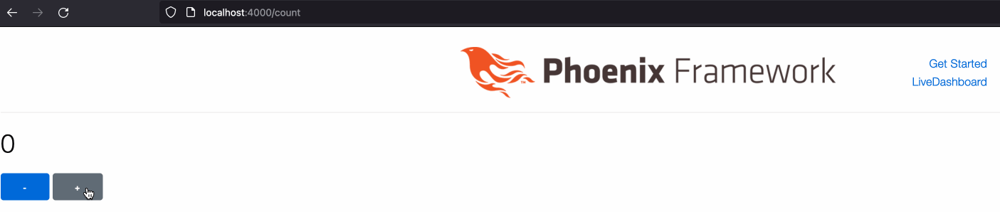

# Building LiveView Apps with Surface Components
Phoenix LiveView has been updating and receiving a lot of cool functionalities and turning into a more mature and stable tool to use and build web applications.

A few months ago, I started to learn Surface, and I surprise how Surface brings more color to LiveView applications.

I decide to write a series of blog posts about Surface, and what I've learned from this journey.

So, what is Surface? The Surface is a server-side rendering component library for Phoenix, as same as LiveView in many ways, and has its own Template DSL, this means instead of you use `HEEx` template, you can use the `~F()` sigil as same as LiveView has  `~H()`, and also you can put the template into a file with the `.sface` extension. Also, Surface allows you to model your front-end components more intuitively with only a small Elixir portion, and this means you have some ways how to structure and present your user interface. To give you one example you can use `case` in the Surface template, also you can have more than that.

Before going to the fun part, let me tell you what you expect to see here.
- You will see how to install, and initialize the Surface in your project.
- We will navigate and understand the diff what is patching to our project.
- Writing our first interface and seeing if everything is working.
- Wrap up for all we did so far.

## Installing Surface
Let's start by taking a look at how to install and use Surface in your Phoenix project.

Once you have your phoenix(`mix phx.new acme --module ACME`) project, the next step is to add Surface as a dependency in your `mix.exs`:
```diff
defp deps do
  [
    {:phoenix, "~> 1.6.9"},
    {:phoenix_ecto, "~> 4.4"},
    {:ecto_sql, "~> 3.6"},
    {:postgrex, ">= 0.0.0"},
    {:phoenix_html, "~> 3.0"},
    {:phoenix_live_reload, "~> 1.2", only: :dev},
    {:phoenix_live_view, "~> 0.17.5"},
    {:floki, ">= 0.30.0", only: :test},
    {:phoenix_live_dashboard, "~> 0.6"},
    {:esbuild, "~> 0.4", runtime: Mix.env() == :dev},
    {:swoosh, "~> 1.3"},
    {:telemetry_metrics, "~> 0.6"},
    {:telemetry_poller, "~> 1.0"},
    {:gettext, "~> 0.18"},
    {:jason, "~> 1.2"},
    {:plug_cowboy, "~> 2.5"},
+    {:surface, "~> 0.7.4"}
  ]
end
```

After fetching the dependencies with `mix do deps.get, deps.compile`, you can run the `mix surface.init` task to update the necessary files in your project. Besides, before that, it's good to run `mix help surface.init` first, and check out all the options it can use.

```shell
$ mix surface.init
...

Note: This task will change existing files in your project.

Make sure you commit your work before running it, especially if this is not a fresh phoenix project.

Do you want to continue? [Yn] y

...
Generated acme app
* patching .formatter.exs
* patching .gitignore
* patching assets/js/app.js
* patching config/config.exs
* patching config/dev.exs
* patching lib/acme_web.ex
* patching mix.exs

Finished running 10 patches for 7 files.
10 changes applied, 0 skipped.

The following dependencies were updated/added to your project:

  * surface_formatter

Resolving Hex dependencies...
```

## Exploring the Generated Files

Let's check out each file Surface generated and understand them better, one by one.

### .formatter.exs
The Surface has changed the `.formatter.exs` file so that our Surface code will be formatted automatically with the help of the [suface_formatter](https://github.com/surface-ui/surface_formatter). Now, when you run `mix surface.format`, all your surface code will be formatted properly.

```diff
[
-  import_deps: [:ecto, :phoenix],
-  inputs: ["*.{ex,exs}", "priv/*/seeds.exs", "{config,lib,test}/**/*.{ex,exs}"],
-  subdirectories: ["priv/*/migrations"]
+  import_deps: [:ecto, :phoenix, :surface],
+  inputs: [
+    "{lib,test}/**/*.sface",
+    "*.{ex,exs}",
+    "priv/*/seeds.exs",
+    "{config,lib,test}/**/*.{ex,exs}"
+  ],
+  subdirectories: ["priv/*/migrations"],
+  plugins: [Surface.Formatter.Plugin]
]
```

### assets/js/app.js
The Surface has also updated the `assets/js/app.js` file to import `Hooks`, and pass them to the call to initialize the `liveSocket`. You can go [here](https://surface-ui.org/js_interop) to learn how to use Hooks with Surface, and [here](https://hexdocs.pm/phoenix_live_view/js-interop.html) to learn how to use Hooks with LiveView.

```diff
+import Hooks from "./_hooks"

 let csrfToken = document.querySelector("meta[name='csrf-token']").getAttribute("content")
-let liveSocket = new LiveSocket("/live", Socket, {params: {_csrf_token: csrfToken}})
+let liveSocket = new LiveSocket("/live", Socket, {params: {_csrf_token: csrfToken}, hooks: Hooks})
```

### config/config.exs

Next up, let's take a look at the `config/config.exs` file.

```diff
+config :surface, :components, [
+  {Surface.Components.Form.ErrorTag, default_translator: {ACMEWeb.ErrorHelpers, :translate_error}}
+]
```

Here, it sets an `ErrorTag` form component when your form has some errors so that you can see changeset errors for the form visually on the page.

### config/dev.exs

The Surface generator also updated the `config/dev.exs` file by adding a reload compiler for Surface. This means that every time we change and save our Surface component, the compiler will compile the newest version of our code and reload the app so that you can see the changes without having to refresh the page in the browser.

```diff
config :acme, ACMEWeb.Endpoint,
- reloadable_compilers: [:gettext, :elixir],
+ reloadable_compilers: [:gettext, :elixir, :surface],
  live_reload: [
    patterns: [
      ~r"priv/static/.*(js|css|png|jpeg|jpg|gif|svg)$",
      ~r"priv/gettext/.*(po)$",
-     ~r"lib/acme_web/(live|views)/.*(ex)$",
+     ~r"lib/acme_web/(live|views|components)/.*(ex|sface|js)$",
      ~r"lib/acme_web/templates/.*(eex)$"
    ]
  ]
```

### lib/acme_web.ex

The Surface generator updated the `lib/acme_web.ex` to import Surface to all of the views.

```diff
  def view do
    quote do
      use Phoenix.View,
        root: "lib/acme_web/templates",
        namespace: ACMEWeb

      # Import convenience functions from controllers
      import Phoenix.Controller,
        only: [get_flash: 1, get_flash: 2, view_module: 1, view_template: 1]

      # Include shared imports and aliases for views
      unquote(view_helpers())
+      import Surface
    end
  end
```

### mix.exs

The `mix.exs` now contains the Surface compiler. So, your app now knows how to compile Surface code. That file now also includes new dependencies. The `Surface` itself, and `surface_formater`.

```diff
  def project do
    [
      app: :acme,
      version: "0.1.0",
      elixir: "~> 1.12",
      elixirc_paths: elixirc_paths(Mix.env()),
-      compilers: [:gettext] ++ Mix.compilers(),
+      compilers: [:gettext] ++ Mix.compilers() ++ [:surface],
      start_permanent: Mix.env() == :prod,
      aliases: aliases(),
      deps: deps()
    ]
  end
```

```diff
defp deps do
    [
      {:phoenix, "~> 1.6.9"},
      {:phoenix_ecto, "~> 4.4"},
      {:ecto_sql, "~> 3.6"},
      {:postgrex, ">= 0.0.0"},
      {:phoenix_html, "~> 3.0"},
      {:phoenix_live_reload, "~> 1.2", only: :dev},
      {:phoenix_live_view, "~> 0.17.5"},
      {:floki, ">= 0.30.0", only: :test},
      {:phoenix_live_dashboard, "~> 0.6"},
      {:esbuild, "~> 0.4", runtime: Mix.env() == :dev},
      {:swoosh, "~> 1.3"},
      {:telemetry_metrics, "~> 0.6"},
      {:telemetry_poller, "~> 1.0"},
      {:gettext, "~> 0.18"},
      {:jason, "~> 1.2"},
      {:plug_cowboy, "~> 2.5"},
-     {:surface, "~> 0.7.4"}
+     {:surface, "~> 0.7.4"},
+     {:surface_formatter, "~> 0.7.4"}
    ]
  end
```

## Building Your First Surface Component

Now we're ready to implement the traditional "counter" in Surface.

We need to create a new route in `lib/acme_web/router.ex`, like this:
```diff
scope "/", ACMEWeb do
  pipe_through :browser

+ live "/count", CounterLive
end
```

Create the `live` folder in `lib/acme_web/live/`, and then create your `counter_live.ex`.

Your `CounterLive` live view module should look like this:
```elixir
defmodule ACMEWeb.CounterLive do
  use Surface.LiveView

  data count, :integer, default: 0

  def render(assigns) do
    ~F"""
    <div>
      <h1 class="title">
        {@count}
      </h1>
      <div>
        <button class="button is-info" :on-click="dec">
          -
        </button>
        <button class="button is-info" :on-click="inc">
          +
        </button>
      </div>
    </div>
    """
  end

  def handle_event("inc", _value, socket) do
    {:noreply, update(socket, :count, &(&1 + 1))}
  end

  def handle_event("dec", _value, socket) do
    {:noreply, update(socket, :count, &(&1 - 1))}
  end
end
```

Let's break this down line by line to understand how Surface works.

The `use Surface.LiveView` brings in the Surface behavior. Surface components are just a wrapper around LiveView components.

Before explaining what this `data` means, let's step back and remember the workflow for developing live pages with LiveView. First thing first, you need to create the [`mount/3`](https://hexdocs.pm/phoenix_live_view/Phoenix.LiveView.html#c:mount/3) function, and you can do nothing and return `{:ok, socket}` a tuple, but in general, we like to bootstrap our live page, and how do we do that? it is [`assign/2`](https://hexdocs.pm/phoenix_live_view/Phoenix.LiveView.html#assign/2) thing through the socket.

Also, the [`data`](https://surface-ui.org/data) macro was held their state in the socket's assigns. In Surface, those assigns are called data assigns.

To declare a data assign:

> __data__ name, type, options

The [`render/1`](https://hexdocs.pm/phoenix_live_view/Phoenix.LiveView.html#c:render/1) function renders the template. Since we are using the Surface component, instead of using the `HEEx` template with the sigil(`~H`) or moving the `render/1` code and putting it on the file with the `.heex` extension, we use the sigil(`~F`), and the file must have the `.sface` extension. By the way, another difference between these templates is the embedded dynamic parts in `HEEx`, we only use the `{}` for HTML attributes, otherwise, you need to keep using the oldest embedded notation `<%= %>`. In Surface this is another ergonomic benefit, you always use `{}` HTML attributes and present your data. And you can see that when we present the value in `{@count}`.

Now, we need to increment and decrement the value in `@count`. How are we gonna do that? It is adding bindings for __Click Events__, and what does this mean? When someone clicks the button it will trigger an event on the client-side for the server to handle this event, and here we can take a look at how LiveView does dor that:

```elixir
<button class="button is-info" phx-click="dec">
  +
</button>
<button class="button is-info" phx-click="inc">
  +
</button>
```

The surface has this `:on-[event]` directive as the same as `phx-[event]`. In case you like to take a look at the [LiveView Bindings](https://hexdocs.pm/phoenix_live_view/bindings.html), and here you could compare it with [Surface Events](https://surface-ui.org/events).

Bear with us, we are almost finished and [`handle_event/3`](https://hexdocs.pm/phoenix_live_view/Phoenix.LiveView.html#c:handle_event/3) is the same for both.

### preview



## wrapping up

For this is just the beginning we can see some differences between LiveView and Surface, and the amazing ergonomics Surface provides for us, and some of them are:
- An installer(initializer) where add some code for us, instead of we write for ourselves.
- The `data` macro where hold their state in the socket's assigns.
- The surface template uses the sigil(`~F`) or the `.sface` extension files.
- Add the client-side bindings to trigger events.
- Handling events on the server-side.

You should try to add the reset event, and once someone clicks on the reset button, should trigger a server-side event, and this should reset the `@count` value to zero.

This is just the beginning of our journey, and I like to cover more things and show what Surface can do for us in the next blog posts, so keep up and stay tuned.
